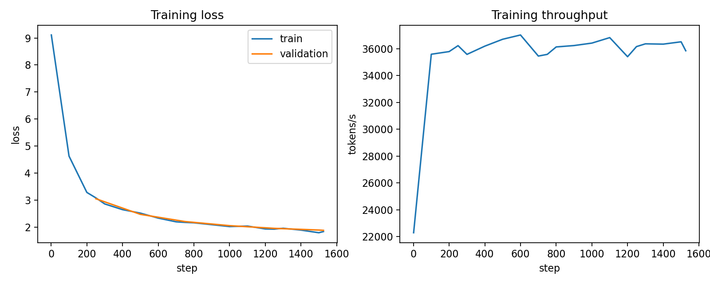
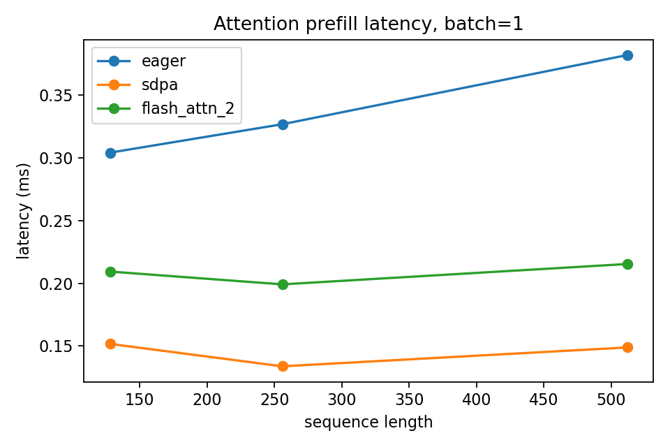
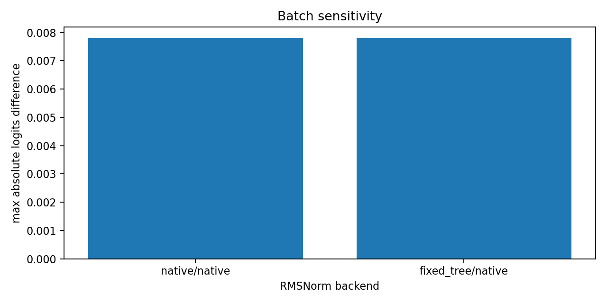
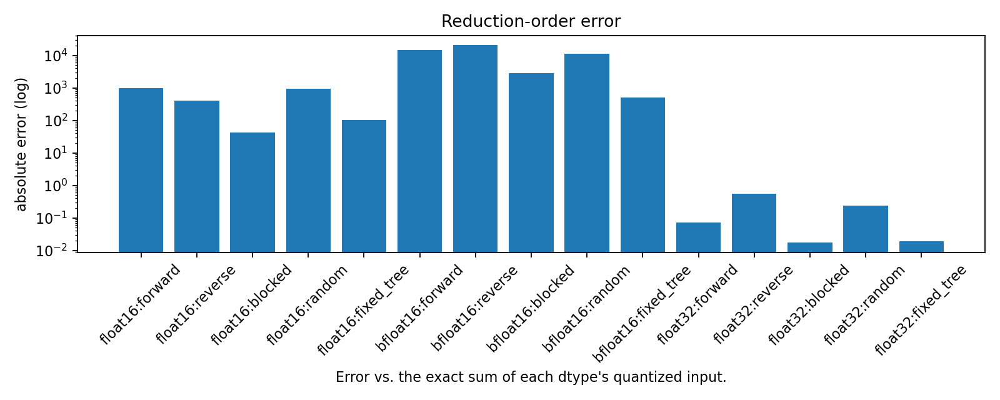
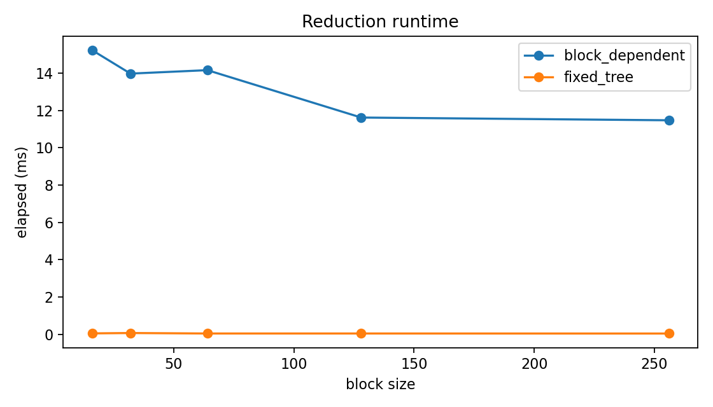
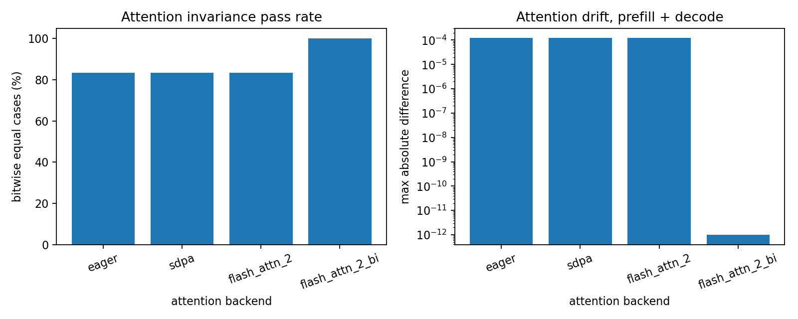
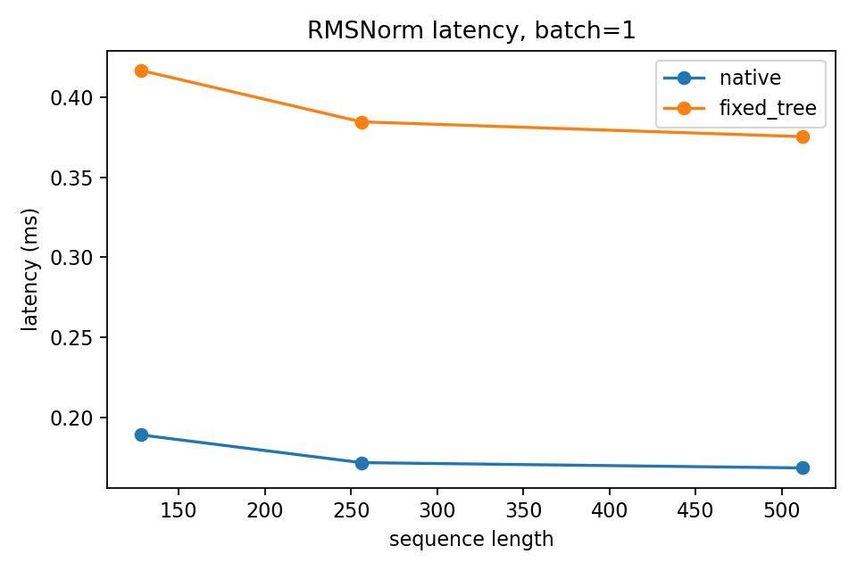
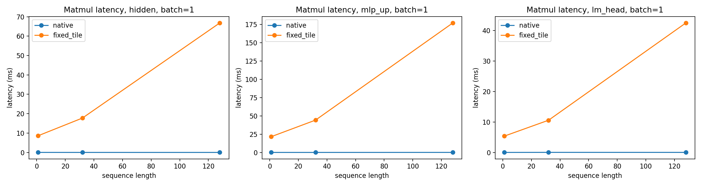
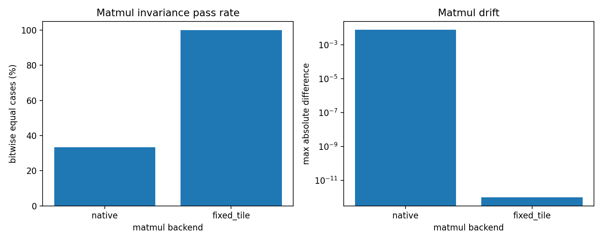

# TinyLM 模型推理的批次不变性及其加速

## 摘要

本项目在单张 NVIDIA GeForce RTX 4060 Laptop GPU 上实现并训练了一个
TinyLlama-style decoder-only Transformer。模型包含 RMSNorm、RoPE、GQA、SwiGLU
和 causal language modeling objective。主模型实际参数量为 34,264,800，在
TinyStories 的 5000 万 BPE token 上完成 1526 步训练，最终验证损失为 1.8850，
验证困惑度为 6.5866。

性能实验已完成 eager attention、PyTorch SDPA 与 Dao-AILab 官方
FlashAttention-2 2.8.3 的算子级对比。正式测试使用主模型 shape：8 个 query heads、
4 个 KV heads、head dimension 60。在 9 个 prefill shape 上，FlashAttention-2
相对 eager 平均加速 3.44 倍，但相对 SDPA 平均为 0.76 倍；在 decode 上，
FlashAttention-2 相对 eager 和 SDPA 分别为 0.65 倍和 0.69 倍。结果说明本机
短序列性能高度依赖 shape，不能预设 FA2 始终快于 PyTorch SDPA。

确定性实验分三层：固定 10 个 prompt 的 batch sensitivity 得到 400 组结果，其中
263 组出现非零 logits 漂移，但没有 greedy 输出分叉；进一步的低 margin 搜索从
8155 个候选中保留 100 个，并测试 2000 个 batch composition case，发现 56 个
`temperature=0` greedy 输出分叉。toy reduction 实验表明，依赖 block size 的归约得到
4 种结果，而固定归约树只得到 1 种结果。模型级 fixed-tree RMSNorm 已实现并测试，
新增 `flash_attn_2_bi` attention 后端固定 KV split size 和 online-softmax 归约顺序；
新增 `BatchInvariantLinear` 覆盖 projection、MLP 和 LM head 的矩阵乘归约。当前版本
已在训练好的 TinyLM checkpoint 上完成严格同参数对照：原生 SDPA 路径的 40 个
跨 composition FP16 logits case 全部出现非零差异，其中 11 个改变 top-1；全
fixed-order 路径的 60 个 case 则全部逐比特一致，代表性低 margin prompt 在 5 种
batch composition 下连续生成 8 个相同 token；
但这些 fixed-order 路径是 PyTorch 参考实现，不是高性能 CUDA/Triton kernel。

## 1. 研究目标与范围

项目围绕以下问题展开：

1. 在有限算力下，能否复现 TinyLlama 架构族的小型语言模型预训练流程？
2. FlashAttention-2 相对 eager attention 和 SDPA 的性能收益是多少？
3. batch size/composition 是否会改变相同 prompt 的 logits 和 greedy generation？
4. 固定 RMSNorm、attention 和后续 matmul 的归约策略能否恢复 batch invariance？

本项目的训练对象是 TinyLlama-style 30M 级模型，不是 TinyLlama 1.1B 的完整预训练
复现。vLLM continuous batching、Qwen3-8B 的 1000 次并发请求和系统级算子替换属于
后续扩展，不纳入当前报告的完成标准。

## 2. 实验环境

| 项目 | 实测值 |
|---|---|
| GPU | NVIDIA GeForce RTX 4060 Laptop GPU |
| OS | Linux / WSL2 |
| Python | 3.11.15 |
| PyTorch | 2.5.1 |
| CUDA | 12.1 |
| cuDNN | 9.1 |
| 训练精度 | FP16 |
| 随机种子 | 42 |
| FlashAttention-2 | 2.8.3，官方 `flash_attn_func` 已通过 GPU 验证 |

最终环境记录见 `results/main_experiments_30m_v2/environment.json`。该文件生成时
工作区存在未提交修改，因此 Git 状态只用于说明运行环境，不代表最终提交状态。

## 3. 数据与 Tokenizer

训练数据使用 `roneneldan/TinyStories`。数据准备采用固定随机种子和 streaming
shuffle，并在训练文本上训练 8000 词表的 SentencePiece BPE tokenizer。

| 划分 | 文档数 | Token 数 |
|---|---:|---:|
| Train | 234,534 | 50,000,000 |
| Validation | 9,838 | 2,000,000 |

完整统计见 `data/processed/tinystories/dataset_stats.json`。WikiText-2 Raw test split
只用于域外困惑度评估，不参与训练。

## 4. 模型与训练结果

模型使用 12 层 Transformer、hidden size 480、8 个 query heads、4 个 KV heads、
SwiGLU 中间层和长度 1024 的 RoPE position embedding。训练 sequence length 为
512，micro batch 为 8，gradient accumulation 为 8，每个优化步骤处理 32,768
token。

| 指标 | 结果 |
|---|---:|
| 实际参数量 | 34,264,800 |
| 训练步数 | 1,526 |
| 已见 token | 50,003,968 |
| 训练耗时 | 1,397.70 秒 |
| 平均 token throughput | 约 35,800 token/s |
| 峰值显存 | 2,303.26 MB |
| 最终训练损失 | 1.8403 |
| 最终验证损失 | 1.8850 |
| 最终验证困惑度 | 6.5866 |

验证困惑度从 step 250 的 21.2181 持续下降到 step 1526 的 6.5866，说明训练流程
正常收敛。固定 prompt 的 greedy generation 已能生成结构基本完整的 TinyStories
风格短故事，因此可以认定“小语言模型训练”主线已经完成。

域外 WikiText-2 test perplexity 为 875.76。该值明显高于 TinyStories validation
perplexity，符合“小模型只在合成儿童故事语料上训练、跨域泛化有限”的预期，不能用
TinyStories 域内指标替代通用语言能力评价。

## 5. Attention 性能实验

实验比较 eager attention、PyTorch SDPA 和 FlashAttention-2，覆盖 batch size
1/4/8、sequence length 128/256/512，并分别测量 full causal prefill 与单 query
decode。每个 shape 预热 20 次、计时 100 次并重复 3 轮。

### 5.1 论文与官方代码依据

标准 scaled dot-product attention 可以写成：

`Attention(Q, K, V) = softmax(QK^T / sqrt(d)) V`

朴素实现通常会显式生成 attention score 矩阵和 softmax 结果。对 batch size 为
`B`、head 数为 `H`、序列长度为 `N` 的 full attention 来说，中间矩阵规模是
`B * H * N * N`。当 `N` 增大时，主要瓶颈不只是乘法次数，还包括把这些大矩阵在
GPU high bandwidth memory 和 on-chip SRAM 之间来回读写。也就是说，attention
常常受 memory traffic 限制，而不是单纯受矩阵乘算力限制。

FlashAttention 系列的核心思路是 IO-aware attention：不把完整 `N x N` attention
矩阵写回显存，而是把 Q/K/V 分块搬到片上存储，在 block 内完成 score、mask、
softmax 归一化和乘 V 的计算，并用在线 softmax 维护每一行的最大值和归一化因子。
这样可以精确得到与标准 attention 等价的结果，同时显著减少显存读写。这里的
“精确”等价指算法仍在计算标准 attention 公式，不是低秩、稀疏或采样近似；实际
数值仍会因为 FP16/BF16 和 kernel 计算顺序不同而存在小误差。

FlashAttention-2 在 FlashAttention 的基础上进一步优化并行策略。论文的主要改进
可以概括为三点：

1. **减少非矩阵乘 FLOPs。** GPU Tensor Core 对矩阵乘非常快，但 rescale、mask、
   bound check、softmax 归一化等非 matmul 操作相对昂贵。FA2 重排计算流程，减少
   这类额外操作在总耗时中的比例。
2. **沿 sequence length 增加并行度。** 原始实现主要按 batch 和 head 并行；当
   batch/head 数不够大时，GPU occupancy 不足。FA2 允许把同一个 head 的 sequence
   维度切到多个 thread blocks 上，提高长序列和小 batch 场景下的并行度。
3. **改进 warp 级工作划分。** FA2 调整 thread block 内不同 warp 的分工，减少
   warp 之间通过 shared memory 同步和交换中间结果的开销，让更多时间花在矩阵乘
   本身。

论文在 A100 上报告 FlashAttention-2 达到理论峰值的 50%-73%，并在 GPT 风格模型
训练中达到最高 225 TFLOPs/s [2]。这个数字用于说明论文实现的上限和动机，但不能
直接当作本项目 RTX 4060 Laptop GPU 上的预期结果，因为硬件、序列长度、训练/推理
方向和 benchmark 范围都不同。

本项目没有重新实现论文中的 CUDA/CUTLASS kernel，而是直接调用 Dao-AILab 官方
`flash-attn` 2.8.3 包 [3]。官方接口规定：

- `flash_attn_func` 计算 `softmax(QK^T * scale)V`，默认
  `scale = 1 / sqrt(head_dim)`；
- Q/K/V 布局分别为 `[batch, seqlen, heads, head_dim]`；
- K/V heads 可以少于 Q heads，从而直接支持 MQA/GQA，且 Q heads 必须能被 KV
  heads 整除；
- 当 query length 与 key length 不同时，causal mask 采用右下对齐；完全被 mask
  的行输出为零；
- FP16/BF16 和不超过 256 的 head dimension 属于官方 CUDA 支持范围 [3][4]。

对应到本项目，正式 shape 应为 8 个 Q heads、4 个 KV heads、`head_dim=60`。
代码中的 SDPA/eager reference 已按同一右下对齐 causal 语义实现，并增加了
GQA、decode 和全 mask 行测试。

这一点很重要：本项目评估的是“论文作者官方实现作为第三方高性能 kernel 接入后，
在本机和本模型 shape 下带来的收益”，不是重新设计一个新的 attention kernel。实现
工作集中在三件事：第一，保证 Q/K/V reshape 后符合官方接口；第二，让 eager 和
SDPA reference 使用同样的 GQA head 映射、scale 和 causal mask；第三，用测试覆盖
prefill、decode、GQA 和不等长 causal mask，避免把接口语义错误误判为性能或数值
差异。

### 5.2 Prefill 与 Decode 的差异

本项目把 attention benchmark 分成两类 workload：

- **Prefill**：一次性处理完整 prompt，query length 和 key length 都等于当前序列
  长度。此时 attention score 是近似 `N x N` 的三角 causal 矩阵，显存访问量和
  softmax 计算量都随序列长度快速增长。
- **Decode**：KV cache 已经存在，每一步只为 1 个新 token 计算 query，query
  length 为 1，key length 为历史上下文长度。此时计算更像 `1 x N` attention，
  单次 kernel 的工作量小得多。

因此，FA2 的收益通常更容易在 prefill 中体现：它避免写出完整 attention 矩阵，且
有足够大的计算块摊薄 kernel launch、调度和数据搬运开销。Decode 阶段每次只处理
一个 query，attention 本身的矩阵规模较小，整体耗时更容易被 kernel launch、KV
cache 读取、后端调度和其他模型层开销影响。对于本项目这种 RTX 4060 Laptop GPU、
`head_dim=60`、最大 sequence length 512 的前向 microbenchmark，decode 中 FA2
与 PyTorch SDPA 接近是合理结果，并不否定 FA2 在长序列 prefill 或训练场景中的价值。

### 5.3 正式结果

`results/main_experiments_30m_v2/benchmarks/attention_benchmark.csv` 包含正式 GQA
运行。所有 162 行均为 `ok`：3 个 backend × 2 个 workload × 3 个 batch size ×
3 个 sequence length × 3 次重复。

| Workload | SDPA vs eager 平均加速 | FA2 vs eager 平均加速 | FA2 vs SDPA |
|---|---:|---:|---:|
| Prefill | 3.98x | 3.44x | 平均 0.76x，范围 0.62x - 1.12x |
| Decode | 0.96x | 0.65x | 平均 0.69x，范围 0.61x - 0.86x |

最大 shape `batch=8, seq_len=512` 中，prefill 的 FA2 相对 eager 加速 12.49 倍，
相对 SDPA 加速 1.12 倍；decode 的 FA2 相对 eager和 SDPA 分别为 0.70 倍和
0.86 倍。FA2 相对 SDPA 的最大绝对误差为 `4.8828125e-4`，最大平均绝对误差为
`8.16e-6`。

显存方面，prefill 的平均算子增量峰值显存为：

| Backend | Prefill 平均峰值显存 | Prefill 最大峰值显存 |
|---|---:|---:|
| eager | 40.48 MB | 168.00 MB |
| SDPA | 7.59 MB | 24.75 MB |
| FlashAttention-2 | 6.33 MB | 20.50 MB |

结果说明，在本机 RTX 4060 Laptop GPU 和项目 GQA shape 下，FlashAttention-2
相对 eager 仍明显减少 prefill 时间和显存，但在多数短序列 shape 上没有超过 SDPA；
只有最大 prefill shape 超过 SDPA。decode 中 FA2 也慢于本轮 eager/SDPA。不能把论文
在 A100、较长序列和 forward+backward 设置下的结果直接预设为本机结论。

### 5.4 与论文复现的边界

本实验是前向推理 microbenchmark，不是论文的 A100 forward+backward benchmark。
它也不包含 QKV projection、完整模型、真实 paged KV cache、tokenizer 或 serving
scheduler 开销。因此报告可以说“调用并验证了论文作者的官方 FA2 实现”，不能说
“逐行复现了论文 CUDA kernel”或“复现了论文中的训练吞吐”。

更具体地说，本项目可以支持以下结论：

- 官方 FA2 2.8.3 能在本项目环境中正常运行；
- 本项目的 Q/K/V layout、GQA 语义和 causal mask 规则已与官方接口对齐；
- 在主模型 GQA shape 下，FA2 对 prefill 相比 eager 有加速和显存优势；
- 在本机短序列 microbenchmark 中，FA2 相比 SDPA 的优势不稳定，本轮平均慢于 SDPA。

本项目不能支持以下结论：

- 不能说自己复现了 FA2 论文的 CUDA/CUTLASS 内核实现；
- 不能说复现了论文在 A100 上的 50%-73% 峰值利用率或 225 TFLOPs/s；
- 不能把 attention 单算子加速直接等同于完整模型训练或 serving 吞吐提升；
- 不能把 RTX 4060 Laptop GPU 上的短序列结果外推到 A100/H100 长序列训练。

## 6. Batch Size/Composition 敏感性

`src/determinism/batch_sensitivity.py` 将 10 个固定 prompt 分别放入 batch size
1、2、4、8 的不同组合中，并比较目标位置 logits、top-5 token 和 32-token greedy
generation。实验覆盖 eager/SDPA、FP32/FP16 和 native/fixed-tree RMSNorm。

| 指标 | 结果 |
|---|---:|
| 成功实验数 | 400 |
| 非零 logits 差异 | 263 |
| 最大绝对 logits 差异 | 0.0078125 |
| top-1 改变 | 0 |
| top-5 排序改变 | 1 |
| greedy 输出分叉 | 0 |

FP32 的最大差异为 `1.1444e-5`，FP16 的最大差异为 `0.0078125`，说明低精度会
放大 batch composition 引起的数值漂移。fixed-tree RMSNorm 与 native RMSNorm 在
该实验中的最大 logits 漂移相同，说明当前漂移主要还来自 attention/linear 等其他
算子和后端策略，而不是 RMSNorm 单点。但本次固定 prompt 没有处在足够接近的 token
决策边界上，因此漂移没有改变 argmax，也没有产生 greedy 输出分叉。

这一结果支持的准确结论是：“改变 batch composition 可以改变相同 prompt 的
logits，且 FP16 漂移更大。”固定 prompt 未产生 greedy 分叉，因此需要专门搜索
低 margin prompt。

### 6.1 低 Margin Prompt 搜索

`src/determinism/divergence_search.py` 从 TinyStories validation 中抽取 2000 篇文档，
按 prefix length 8/16/32/64/128 形成 8155 个候选。脚本用 FP16 SDPA 排序，保留
top-1/top-2 margin 最小的 100 个 prompt，再对 eager/SDPA、FP32/FP16 和 5 种
batch composition 生成 128 个 token。

| 指标 | 结果 |
|---|---:|
| 候选 prompt 总数 | 8,155 |
| 保留低 margin prompt | 100 |
| 测试 case | 2,000 |
| 非零 logits 差异 | 1,598 |
| top-1 改变 | 27 |
| top-5 改变 | 31 |
| greedy 输出分叉 | 56 |
| 最大绝对 logits 差异 | 0.00830078125 |

分叉全部发生在 FP16：

| Backend / dtype | 测试 case | Greedy 分叉 | Top-1 改变 |
|---|---:|---:|---:|
| eager / FP32 | 500 | 0 | 0 |
| eager / FP16 | 500 | 30 | 17 |
| SDPA / FP32 | 500 | 0 | 0 |
| SDPA / FP16 | 500 | 26 | 10 |

第一个分叉案例是 candidate rank 2，prompt 为
`John and Lucy were playing in the backyard...`，baseline margin 为 0。它在
`eager/FP16/B_one_short` 下第 76 个生成 token 开始分叉。另一个 SDPA/FP16 案例在
candidate rank 44 的 `E_mixed_lengths` composition 中第 0 个生成 token 即分叉，并且
top-1/top-5 均改变。这证明 `temperature=0` 只固定 argmax 规则，不能保证不同
batch composition 下输出逐比特或逐 token 相同。

第 6.1 节用于扩大反例搜索范围，覆盖 2 个 attention backend、2 种 dtype 和 5 种
composition。它与下一节的轻量验证预算不同，因此不直接用两张总表比较改进幅度。

### 6.2 原生与改进模型同参数对照

完整 fixed-order 模型使用 `flash_attn_2_bi` attention、`fixed_tree` RMSNorm 和
`fixed_tile` Linear。由于这些路径是 Python/PyTorch 参考实现，直接重复第 6.1 节的
2000 case × 128-token 搜索计算量过大。本节采用分层验证：下一 token logits 使用较多
prompt，连续 greedy generation 只使用一个已知的困难案例。

logits 验证复用第 6.1 节排名前 20 的低 margin prompt，并在 FP16 下分别放入
`A_target_only`、`C_seven_short` 和 `E_mixed_lengths` 三种 composition。模型只对
每个 batch 样本的最后有效位置执行 LM head，避免为所有 padding/prefill 位置计算完整
词表 logits。fixed-tile 参数为 `tile_m=16`、`tile_n=256`、
`k_block_size=480`。

原生组与改进组加载同一个 `results/train_30m/best_checkpoint.pt`，模型参数和输出
logits 均为 `torch.float16`。两组使用完全相同的 20 个 prompt 和 3 种 composition；
唯一主动变化的实验变量是算子组合：原生组为 SDPA、native RMSNorm 和 native
Linear，改进组为全 fixed-order 路径。

| 指标 | 原生 SDPA | 改进模型 |
|---|---:|---:|
| 低 margin prompt | 20 | 20 |
| 测试 case | 60 | 60 |
| 逐比特相同 logits | 20 / 60 | 60 / 60 |
| 非零 logits 差异 | 40 | 0 |
| Top-1 改变 | 11 | 0 |
| Top-5 改变 | 11 | 0 |
| 最大绝对 logits 差异 | 0.0078125 | 0.0 |

每组 60 个 case 都包含 20 个 `A_target_only` baseline，实际跨 composition 比较为
40 组。原生路径的 20 个逐比特相同 case 均为 baseline 自比较，40 个跨 composition
case 全部出现漂移。逐比特相同使用 `torch.equal` 比较目标位置的完整词表 FP16
logits，不是只比较 argmax 或设置误差容忍阈值。

连续生成验证选择 candidate rank 44。该 prompt 在原始 FP16 路径中是已知反例：
`eager/D_one_long` 和 `SDPA/E_mixed_lengths` 都在第 0 个生成 token 发生分叉。
其内容为：
> Jimmy was at the store with his mom. He was excited to see all the different
> kinds of candy. He wanted some sugar and asked his mom if he could get some.
> His mom said yes, so they went over to the shelf with the sugar. Jimmy saw a
> lot of different kinds of sugar. White

改进后模型对同一个 prompt 测试全部五种 composition：

| Composition | Batch size | 8-token hash | 与 baseline 相同 |
|---|---:|---|---|
| A_target_only | 1 | `5ced54c07fcc` | 是 |
| B_one_short | 2 | `5ced54c07fcc` | 是 |
| C_seven_short | 8 | `5ced54c07fcc` | 是 |
| D_one_long | 2 | `5ced54c07fcc` | 是 |
| E_mixed_lengths | 4 | `5ced54c07fcc` | 是 |

五组结果的 token IDs 均为
`[7907, 10, 2470, 30, 133, 1177, 7899, 62]`，续写均为
`, the sugar was very hot. He`。通过改变与目标 prompt 同批执行的其他 prompt，因此直接验证了覆盖范围内的 batch composition invariance。

为单独验证 batch size，而不同时改变 batch composition，实验又将 rank 44 的同一个
prompt 复制多份组成 batch。例如 batch size 4 时，batch 中四行都是完全相同的
rank 44 prompt。比较每个 batch 第一行的完整 logits 和连续 8-token 输出：

| Batch size | Batch 内容 | 8-token hash | 输出相同 |
|---|---|---|---|
| 1 | 同一 prompt × 1  | `5ced54c07fcc` | 是 |
| 2 | 同一 prompt × 2  | `5ced54c07fcc` | 是 |
| 4 | 同一 prompt × 4  | `5ced54c07fcc` | 是 |
| 8 | 同一 prompt × 8  | `5ced54c07fcc` | 是 |

因此，在这个例子中只改变 batch size 从 1 到 2、4、8，不改变 prompt 内容，目标样本
仍得到完全相同的 FP16 logits 和
`[7907, 10, 2470, 30, 133, 1177, 7899, 62]` 八个生成 token。续写仍为
, the sugar was very hot. He

## 7. 归约顺序与 Batch Invariance

浮点加法不满足结合律。`src/toy/reduction_order.py` 对同一组数使用 forward、
reverse、blocked、random 和 fixed-tree 顺序求和。在 FP32 中，不同顺序相对 FP64
reference 得到不同误差。为避免 FP16 的动态范围掩盖普通舍入误差，实验根据输入的
`sum(abs(x))` 对所有 dtype 使用同一个 overflow-safe 缩放系数，并在 FP64 中恢复
原始尺度。每种 dtype 的误差基准是其已量化输入通过 `math.fsum` 得到的高精度和，
因此排除了 dtype conversion error，图中只比较不同精度和归约顺序引入的累加误差。

`src/toy/batch_invariant_reduction.py` 改变 block size 16/32/64/128/256：

| 方法 | 不同结果数量 | 是否跨 block size 一致 |
|---|---:|---|
| Block-dependent reduction | 4 | 否 |
| Fixed-tree reduction | 1 | 是 |

结果说明，只要固定归约树和算术执行顺序，就能在该 toy 场景中恢复 bitwise identical
结果。这构成了对 Batch Invariance “尝试解决”的机制级验证。

### 7.1 参考文章与项目实现对应关系

Thinking Machines Lab 指出，batch invariance 不是只固定随机种子，而是要求每个含
reduction 的关键 kernel 不因 batch size 或 batch composition 改变归约策略 [5][6]。
本项目按 RMSNorm、Matmul 和 Attention 三类算子实现 PyTorch reference path：

| 算子 | 参考文章要求 | 本项目代码入口 | 实验依据 | 报告图片 | 当前结论 |
|---|---|---|---|---|---|
| RMSNorm | 每个 row/token 的 hidden-dim reduction 使用固定策略，避免随小 batch 启用 split reduction | `RMSNorm(backend="fixed_tree")` | `rmsnorm_benchmark.*`、`rmsnorm_invariance.*` | `rmsnorm_latency.png` | fixed-tree case 均 bitwise equal，但慢于 native |
| Matmul/Linear | 固定 output tile、K-block 遍历和 kernel strategy，避免 Split-K/Stream-K 改变 K reduction | `BatchInvariantLinear(backend="fixed_tile")` | `matmul_benchmark.*`、`matmul_invariance.*` | `matmul_latency.png`、`matmul_invariance.png` | fixed-tile case 均 bitwise equal，但只是慢速 reference |
| Attention | 沿 Q 并行，按固定 KV 顺序执行 online softmax；decode 使用 fixed split-size 而不是动态 split 数 | `flash_attn_2_bi` | `attention_invariance.*`、`batch_invariant_model_smoke.*` | `attention_invariance.png` | fixed-order attention 在测试 shape 下保持 batch invariant |

Attention 单算子对照覆盖 3 个 sequence length 的 prefill/decode，共 6 个 case。
eager、SDPA 和官方 FA2 各有 5/6 个 case bitwise equal，均在 `decode, seq_len=512`
出现最大绝对差异 `1.220703125e-4`；`flash_attn_2_bi` 为 6/6 bitwise equal，
最大差异为 0。

模型级 RMSNorm 对照中，native 和 fixed-tree RMSNorm 在 18 个单算子 invariance case
中均保持 bitwise equal。性能上，fixed-tree RMSNorm 平均延迟为 native 的 2.13 倍
（范围 1.87x - 2.28x）。这说明固定归约顺序确实有性能代价。

Attention 侧新增 `flash_attn_2_bi` 参考后端：固定 KV split size，按固定 key block
顺序执行 FlashAttention-style online softmax，并用 fixed-tree reduction 固定
`QK` score、softmax denominator 和 `PV` 聚合顺序。这复现参考资料中
“fixed split size / disable dynamic KV split / batch-invariant FA2 kernel”的核心方向。
它是 PyTorch 参考实现，不是高性能 CUDA kernel；官方 FlashAttention-2 仍用于加速
benchmark，`flash_attn_2_bi` 用于证明 attention reduction 可以做成 batch-invariant。

Matmul/Linear 侧新增 `BatchInvariantLinear`：对 attention projection、MLP projection
和 LM head 提供 `linear_backend="fixed_tile"` 路径。该路径按固定 2D output tile
遍历 M/N 输出维度，并按固定 K-block 顺序完成每个 tile 的乘加归约，避免 Split-K /
Stream-K 这类会让归约策略随 batch shape 变化的路径。它覆盖了 reference 中指出的
第三类关键 reduction（RMSNorm、matmul、attention）。和 `flash_attn_2_bi` 一样，
它是可验证的 PyTorch 参考实现，不是 DeepGEMM/Triton 级别的高性能 GEMM kernel。

第 6.2 节的轻量模型级验证进一步证明三类 fixed-order 路径可以同时接入训练好的
30M checkpoint，并在覆盖的 batch composition 下得到相同 logits 和输出。性能结论仍应
依赖 native/SDPA/官方 FA2 加速路径，而不是这些 Python fixed-order 参考路径。

十张报告图片及其源 CSV/JSON 的映射记录在
`results/main_experiments_30m_v2/figures/manifest.json`。这些图片和证据数据随代码
提交到 GitHub；约 411 MB 的 checkpoint、运行日志和开发期临时结果继续只保存在本机。

### 7.2 Batch Invariance 与 On-Policy RL

Batch invariance 在 LLM 推理稳定性之外还有一个直接的下游应用：on-policy 强化学习
训练 [5]。PPO、GRPO 等算法要求采样轨迹严格属于当前 policy。常见工程做法是用高吞吐
inference backend（如 vLLM）做 rollout 采样，再用 training backend（FSDP /
DeepSpeed 等）对同一份权重做参数更新。两条路径上的 kernel 实现、batching 策略和
归约顺序通常不一致，导致 sampler 输出的 logits 与 trainer 用同一份权重重新前向得到的
logits 出现数值差异；当差异跨过低 margin 决策边界时，sampled token 在 trainer
视角下的概率不再等于 sampler 视角下的概率，on-policy 假设被破坏，训练实际退化为
off-policy。这时必须引入 importance sampling 权重
`pi_train(a|s) / pi_sample(a|s)` 来修正，否则梯度估计有偏，并且 KL 漂移会持续累积。

本项目的 `fixed_tree` RMSNorm、`fixed_tile` Linear 和 `flash_attn_2_bi` attention
为 sampler 与 trainer 之间的数值一致性提供了机制基础：只要两条路径都走同一份
fixed-order reduction，无论 batch composition 如何变化，目标 token 的 logits 都
保持 bitwise 一致，importance ratio 严格为 1。把这套 PyTorch 参考路径替换成高性能
batch-invariant kernel 之后，就有条件在不依赖 importance sampling 修正的前提下做
true on-policy PPO / GRPO 训练。当前报告只在推理侧完成了有限规模的模型级一致性验证，
RL 训练侧的端到端验证留作后续工作（见第 9 节）。

## 8. 当前完成度

| 主线任务 | 状态 | 判断 |
|---|---|---|
| TinyLlama-style 小模型实现 | 已完成 | 架构、训练、验证、checkpoint 和生成链路完整 |
| 30M 级主训练 | 已完成 | 5000 万 token、1526 steps 全部完成 |
| eager/SDPA/FlashAttention-2 对比 | 已完成 | 9 个 shape、3 次重复、主模型 GQA shape |
| Batch composition 数值漂移研究 | 已完成 | 400 组固定 prompt 和 2000 组低 margin 搜索 |
| temperature=0 输出分叉复现 | 已完成 | 低 margin 搜索发现 56 个 greedy 分叉 |
| Batch Invariance 机制级解决 | 已完成 | fixed-tree toy experiment 跨 block size 一致 |
| 模型级 Batch Invariance 解决 | 已有参考实现 | 同参数对照从原生 20/60 提升到 fixed-order 60/60，代表 prompt 的 5 种 composition × 8 token 一致 |

因此，项目不是“加速和 Batch Invariance 都没做”。更准确的判断是：

- 小语言模型训练已经完成；
- 官方 FlashAttention-2 已在主模型 GQA shape 上完成三轮 benchmark；
- Batch Invariance 的数值漂移研究、低 margin 输出分叉和 toy 解决方案已经完成；
- 模型级解决方案已覆盖 RMSNorm、Linear/Matmul 和 attention 归约；
- 同参数轻量验证中，原生路径仅 20/60 个 FP16 logits case 逐比特一致，fixed-order
  路径达到 60/60；代表 prompt 在五种 composition 下连续生成 8 个相同 token；
- 后续真正未完成的是高性能 batch-invariant CUDA/Triton GEMM、serving 系统和更大模型验证。

## 9. 后续工作

当前课程项目主线已经闭环。继续扩展时，应优先做三件事：

1. **将 PyTorch 参考实现迁移到 CUDA 高性能 kernel。** 当前 `fixed_tile_matmul`、
   `flash_attn_2_bi` 与 `fixed_tree_rmsnorm` 都是 PyTorch 算子级参考实现，能证明
   fixed-order 归约的数值一致性，但不能作为加速路径。后续应在 CUDA 层面提供
   真正可上生产的高性能实现：优先用 Triton 或 CUTLASS 重写 fixed-order
   batch-invariant GEMM，再写一个 deterministic flash-attention CUDA kernel
   （按 batch 内最长序列做 tile 切分、固定 K/V reduction tree），最后把
   `BatchInvariantLinear` 与 attention 串成端到端的 CUDA graph 路径，并在
   TensorCore 上对吞吐和显存做 benchmark，与 PyTorch 参考路径做一致性回归。
2. **接入真实 serving 场景。** 用 vLLM 或自定义 continuous batching 复现动态批处理，
   对比静态 batch 与 paged KV cache 下的输出唯一性。
3. **扩大模型与硬件。** 在 TinyLlama 1.1B 或 Qwen3-8B 上验证输出分叉和性能代价，
   并与 A100/H100 等数据中心 GPU 上的 FlashAttention-2 表现区分讨论。
4. **小规模 on-policy RL 验证。** 在 batch-invariant CUDA/Triton kernel 上对训练好的
   TinyLM 做 PPO 或 GRPO 微调，验证 sampler 与 trainer 之间 KL 漂移消失、
   importance ratio 严格为 1 [5]。

## 10. 局限性

实验仅使用单张消费级 GPU、一个 34M 参数模型和 TinyStories 合成语料。attention
benchmark 不等同于完整 serving 性能；静态 batch 不等同于 continuous batching；
当前模型只有实验用增量 KV cache，不是 paged KV cache；fixed-tree RMSNorm、fixed-tile Linear 和
`flash_attn_2_bi` 都是 PyTorch 参考实现，不等同于完整 batch-invariant CUDA/Triton
kernel。结果对 GPU、PyTorch、CUDA、dtype 和 kernel 版本敏感，不能直接外推到 A100、
TinyLlama 1.1B 或 8B 模型。

## 11. 结论

本项目已经完成 TinyLlama-style 小语言模型从数据准备、tokenizer、预训练、验证到
生成的完整流程，并取得验证困惑度 6.5866。Attention 实验已经调用 Dao-AILab 官方
FlashAttention-2 2.8.3，并在主模型 GQA shape 上完成三轮 benchmark。FA2 对 prefill
平均比 eager 快 3.44 倍，但平均慢于 SDPA；只有最大 prefill shape 比 SDPA 快
1.12 倍。decode 中 FA2 也未超过本轮 eager/SDPA。

Batch sensitivity 和 low-margin search 共同证明 batch size/composition 会造成 logits
数值漂移，并且在低 margin 决策点可以让 `temperature=0` greedy generation 发生分叉。
本次 2000 个低 margin case 中发现 56 个输出分叉，全部发生在 FP16。fixed-tree toy
experiment 证明固定归约顺序可以恢复跨 block size 的 bitwise consistency；模型级
fixed-tree RMSNorm 已验证但代价约为 2.13 倍延迟，`flash_attn_2_bi` 已固定 attention
KV split 和 online-softmax 归约顺序，`BatchInvariantLinear` 也已覆盖 projection、MLP
和 LM head 中的 fixed-tile 矩阵乘。同参数轻量验证中，原生路径的 40 个跨
composition FP16 logits case 全部漂移且 11 个改变 top-1，fixed-order 路径则
60/60 逐比特一致；已知困难 prompt 在五种 batch composition 下连续生成 8 个相同 token。
该验证范围有限，且加速仍主要来自官方 FlashAttention-2/SDPA 等高性能后端。

## 参考资料

1. Zhang et al., TinyLlama official repository:
   https://github.com/jzhang38/TinyLlama
2. Tri Dao, *FlashAttention-2: Faster Attention with Better Parallelism and Work
   Partitioning*, ICLR 2024:
   https://proceedings.iclr.cc/paper_files/paper/2024/file/98ed250b203d1ac6b24bbcf263e3d4a7-Paper-Conference.pdf
3. Dao-AILab, official FlashAttention repository, tag `v2.8.3`:
   https://github.com/Dao-AILab/flash-attention/tree/v2.8.3
4. Dao-AILab, `flash_attn_interface.py`, tag `v2.8.3`:
   https://github.com/Dao-AILab/flash-attention/blob/v2.8.3/flash_attn/flash_attn_interface.py
5. Thinking Machines Lab, *Defeating Nondeterminism in LLM Inference*:
   https://thinkingmachines.ai/blog/defeating-nondeterminism-in-llm-inference/
6. Thinking Machines Lab, Batch Invariant Ops:
   https://github.com/thinking-machines-lab/batch_invariant_ops
7. 本项目整理，Batch Invariance in LLM Inference 参考摘要：
   `reports/references/batch_invariance_in_llm_inference.md`
